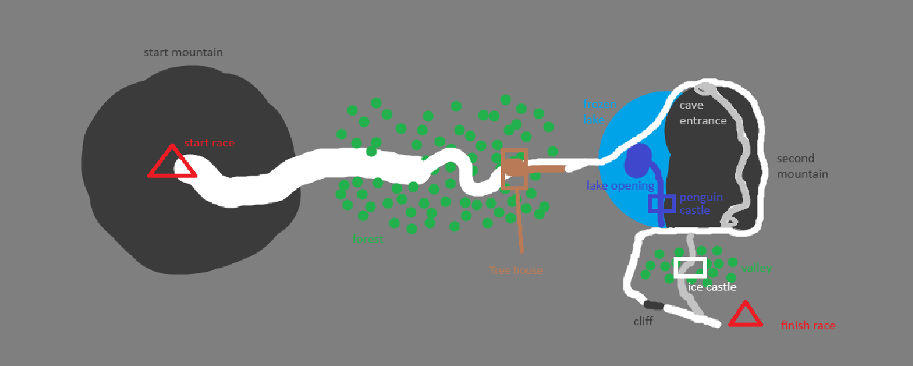

# Slope Direction — The Branching Map

*Director description, 2026-07-24. **Status: a new slope direction, NOT yet
reconciled with the current three-linear-slopes model in DESIGN.md.** The open
questions in §7 are the director's to resolve before this rewrites DESIGN.md.*

> **Build status (2026-07-24).** Greenlit and building on the existing skiing sim
> (confirming §7 #2). Done: the Type A handoff de-risked, then the **whole §4
> topology laid out as grayblock** (`shared/src/route.ts` + `client/src/slopePath.ts`,
> 134 tests). **Now building: the first *playable* slice — the summit → forest ride.**

> **Revision note (2026-07-25, v3).** Unlike the previous revision, this one
> **does change the design sections.** Per the director's top-down map:
>
> - **§2, §4, §5 rewritten.** Yeti's Peak is no longer a Type B split. The cave and
>   the outside line rejoin at the cliff. There is **no Type B on the map.**
> - **The yeti's son moved to the cliff.** Slowing down there gets you shoved onto
>   the valley path — same clock, no life lost.
> - **The ice castle moved** to the valley, reached only by being shoved.
> - **The penguin castle** is confirmed underwater, off the lake opening.
> - **§9's segment budget** re-cut for the new fork structure.
> - **§10's test simplified** — four pairwise assertions, not three route comparisons.
>
> §§1, 3, 6 are substantially unchanged. Diff against the previous file for detail.

---

## 1. The idea in one breath

Instead of multiple separate tracks, a slope is **one continuous map with many
branching opportunities**, skied summit-to-flag as the sun sets (cat on your back,
as always). At certain points the **world reaches out and grabs you** into a detour
world — a tree swallows you, a yeti smashes a hole in a frozen lake, a penguin
swoops in to carry you underwater, a yeti's son shoves you off a cliff — then
returns you to the mountain at roughly the **same point in time** you'd have reached
anyway. One map, many outcomes, so it never feels dry: freshness comes from
**discovery** first (you don't know a world exists until it eats you), then
**mastery** (learning the clean line into each one).

## 2. The kinds of branch

- **Type A — detour that rejoins.** Leaves the spine and returns to the **same
  world-position** at the **same elapsed time**. Cosmetic + collectibles, no lasting
  route change. **Every fork on the map is currently Type A.**
- **Type A involuntary.** Same contract, but the world chooses for you rather than
  you choosing. Currently one: the cliff shove.
- **Type B — route split** that does **not** reunite until the flag. **None on the
  map.** Kept in the vocabulary because it may return; each one is a whole alternate
  segment to build and time-balance, so keep it rare.

The move from one Type B to zero is the single biggest simplification in the
design. See §9.

## 3. The one law everything obeys

> **Same clock, same flag.** Every detour returns you to the same point at ~the same
> time; every full route from summit to flag takes the **same total time**. No line is
> faster — so a friend-race is never won by routing, only by skiing cleaner and
> crashing less. The bird flies at exactly ski speed; no world is a shortcut.

The numbers this law implies are in §9. The tooling that proves it holds is in §10.

## 4. The map (topology)

Read as a resort trail map: sunset at the summit, flag in the valley. Four forks
in series, each rejoining before the next.

```
         START · SUMMIT  (shared, sunset)
                |
         ENCHANTED FOREST — Fork 1 (Type A)
           |            \
        (road)       tree world → tallest tree → bird → back to road
           |            /
         FROZEN LAKE — Fork 2 (Type A)   [yeti smashes a hole]
           |            \
     (around hole)   into hole → drivable penguin → underwater
           |             penguin castle → surface on the road
           |            /
      SECOND MOUNTAIN — Fork 3 (Type A)
           |            \
    (around outside)   through the CAVE
           |            /
          THE CLIFF — Fork 4 (Type A, involuntary)
           |            \
      (jump it clean)   too slow → yeti's son shoves you → steep
           |             face → VALLEY → ICE CASTLE → back to spine
           |            /
            FINISH
```


**Balance four fork-pairs, not eight routes.** Because every fork rejoins, the
eight possible combinations do not need to be timed against each other. Each fork
only has to match itself. This is what replaced the old three-route balancing job.

## 5. Fork-by-fork

**0 · Summit Descent (shared).** Both skiers drop in together down the start
mountain as the sun sets, then glide into the enchanted forest as it goes dark.
No choice yet.

**1 · Enchanted Forest — Type A.** Trigger: hit the great tree at the treehouse;
it swallows you.

- *Into the tree:* ~8s in a world of animals → out the tallest tree → drop into a
  bird and fly it down. Fly too long and it lands you on the road anyway.
- *Stay on the road:* you reach the far tree the moment the tree-taker's bird lands.
- *Exclusive reward:* forest animals + achievement.

**2 · Frozen Lake — Type A.** Trigger: a yeti hoists a boulder and smashes a hole
through the ice in front of you.

- *Into the hole:* a drivable penguin swoops in → underwater world → sunken penguin
  castle → surface back on the normal trail.
- *Around the hole:* skirt the gap, press on to the second mountain.
- *Exclusive reward:* penguin-castle collectibles.
- **Open:** the yeti that causes this is not yet placed on the map, and the exact
  resurface point is undrawn. Both needed before this fork can be built.

**3 · Second Mountain — Type A.** Through the mountain, or around the outside.
Both arrive at the cliff.

- *Through — the cave:* the interior line.
- *Around — the outside:* the exposed line over the shoulder.
- **Open:** the cave has no exclusive reward assigned. Previously the ice castle
  justified this fork; it no longer sits here.

**4 · The Cliff — Type A, involuntary.** The world decides, based on your speed.

- *Fast and clean:* jump the cliff, straight to the flag.
- *Too slow:* the yeti's son shoves you off the side — **no life lost** — down the
  steep face into the valley, through the Ice Castle, back to the spine at the flag.
- *Exclusive reward:* ice-castle collectibles.
- **Director call:** the shove is same-clock, so slowing down at the cliff costs
  nothing, and deliberately slowing is the reliable way to reach the ice castle.
  Either accept that (the shove is a route selector, not a hazard), give it a small
  time cost, or make the ledge an explicit choice rather than a punishment.

## 6. How it maps onto existing Toebeans systems

- **Cat's nine lives — unchanged.** Hitting a wall costs a life; run out and you
  forfeit (half XP), exactly as today.
- **Respawn = checkpoint.** A world's entrance acts as a checkpoint: crash inside a
  world and you restart at its entrance at base speed. Low-stakes worlds are what
  make players brave enough to go in.
- **Shove ≠ crash.** Hazards that only reposition you (the yeti's son) cost **no
  life** — they're the world routing you. Only hitting a wall costs a life.
- **XP / time — compatible.** Since every fork is the same length, time-based XP
  stays fair across branches.
- **Friend-race = the later-phase multiplayer**, not v1.0. Single-player here is
  discovery + collection.

## 7. Open reconciliation (director's call)

1. **Branching map vs. three linear slopes.** Does the branching map become the
   **template all slopes** follow, or is there **one** big branching map plus linear
   others? This decides how Slopes 2–3 and the escalation model are structured.
   **← BLOCKING. See §11.**
2. **Reusing the in-flight Overlook mechanics.** **Resolved 2026-07-24** — branching
   is a routing layer on top of the same skiing sim.
3. **Friend-race timing.** Confirm v1.0 branching map is solo (discovery/collection),
   race lands with the MP phase.
4. **Collectibles + Steam achievements = a new reward layer.** Decide how
   world-exclusive collectibles relate to XP/leveling.
5. **Same-clock authoring cost.** **Largely dissolved by v3** — with no Type B, this
   is four local fork-pair balances rather than three end-to-end route balances.
   See §9 and §10.
6. **New: the cave's exclusive reward.** Fork 3 lost its reward when the ice castle
   moved. Assign one or accept that the cave is scenery-only.

## 8. Build order

1. ✅ Type A handoff de-risked on a throwaway tree fork.
2. ✅ Whole topology grayblocked, 134 tests. **Needs re-grayblocking for v3** — the
   Type B split in `route.ts` becomes a fourth Type A fork.
3. ⏭ First playable slice — the summit → forest ride, dressed.
4. Frozen lake fork + the yeti trigger.
5. Second mountain fork (cave + outside).
6. Cliff fork + the shove.
7. Detour content: animal world, bird, penguin castle, ice castle.
8. Multiplayer, collectibles, achievements, art.

---

## 9. The clock

§3 states the law but never gives it a number. These are the numbers.

### Full-route target

| Value | Target |
|---|---|
| Summit to flag, clean run | **3 min 30 s** |
| Tolerance within any fork-pair | **± 0.5 s** |

Note what changed in v3: there is no longer a separate, looser tolerance for full
routes, because there are no longer full routes to compare. Every fork returns you
to the same world-position, so ±0.5 s applies everywhere — and any drift is
directly visible to a player standing beside someone who took the other branch.

### Segment budget

End-to-end timing tells you the routes drifted. It doesn't tell you where. Balance
per segment:

| Segment | Budget | Fork |
|---|---|---|
| Summit descent | 40 s | Shared |
| Enchanted forest | 40 s | Fork 1 |
| Frozen lake | 45 s | Fork 2 |
| Second mountain | 45 s | Fork 3 |
| Cliff → finish | 40 s | Fork 4 |
| **Total** | **210 s** | |

The 3:30 is a director decision: long enough that four forks each get room to have
their own character, and long enough that the discovery loop in §1 has somewhere to
happen. A 90-second run wouldn't justify four worlds.

### Difficulty stance

Mistakes cost **time**, not runs. Within the nine-lives model (§6): walls cost a
life and a checkpoint restart, and nine of those end the run — but no single mistake
should. No instant fails, no unrecoverable positions.

## 10. Instrumentation

§7 #5 says same-clock is "only provable by grayblocking timings." Make it provable
by machine.

### Same-clock as an automated test

There are already 134 tests. Add one more that matters more than the rest:

> A headless clean-line runner completes both branches of each of the four forks and
> asserts each pair finishes within ±0.5 s. Assert each segment against its §9
> budget. Four pairwise assertions total.

This turns §3 from an intention into something that can't silently break. Any
session that shifts a curve, retimes a detour, or dresses a corridor fails the test
rather than quietly costing you a race three months from now. Build this before
dressing more of the map.

### On-screen debug readouts

On a debug key:

- Which branch of which fork you are currently on
- Elapsed split per segment, against the §9 budget, live
- Current grade under the skier
- Distance along the current segment
- **Teleport to any node in `route.ts`**

The teleport key is not a nicety. Without it, testing a change at the cliff costs a
three-minute ski every attempt, and that cost turns a ten-minute fix into a session.

## 11. Working against this file

### The blocking call

§7 #1 is not the same kind of question as the others. Those can be answered after
more of the map exists. #1 decides whether this map is a template or a one-off,
which changes how `route.ts` should be structured — and `route.ts` is being
rewritten now for v3 anyway. **Resolve #1 before the next session.**

### Session rules

- **One numbered item from §8 per session.** Never two.
- **Point Claude Code at this file rather than re-describing the map.**
- **Plan before code.** Approve the plan, then let it run.
- **State the acceptance test up front**, in §9's terms.
- **When it's wrong, quote this file.** "§9 budgets the forest at 40 s, you built
  55 s" lands; "the forest feels too long" restarts the discussion.
- **Never fix a design point in chat.** Edit the section here first, then rebuild
  from the file. Anything corrected only in conversation is gone next session.
- **Update `ROADMAP.md` at the end of every session.**

### One document

This file is the source of truth for the branching map. If a second spec for the
same map exists anywhere — an artifact, a chat, another markdown file — fold it in
here and delete it. Two parallel specs is the most reliable way to make consecutive
sessions contradict each other.
